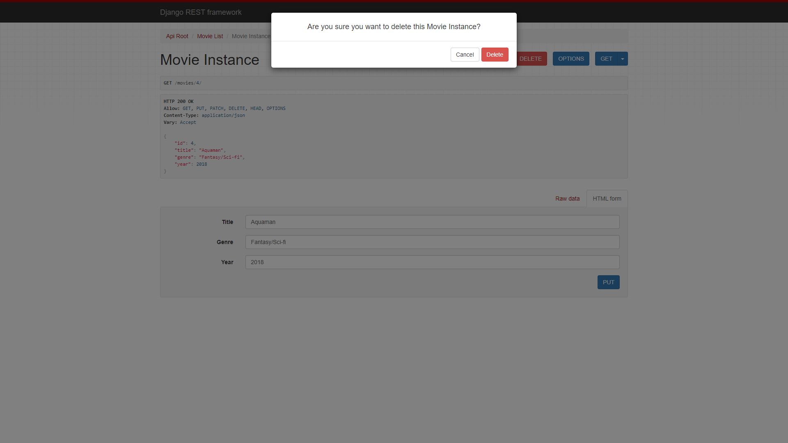

# django-movie-api
django + RESTfulAPI tutorial

  
1. run server with django

 
2. Root page (initial page, URL: localhost:8000).

  
3. Movie List (URL: localhost:8000/movies, GET).
cf. You can see a specific item by adding /# (#: index) at the end of url.

  
4. Adding a movie data (POST).

  
5. Deleting a movie from the list (DELETE).

  
6. The movie is deleted from dataset (GET).

  
7. Meanwhile at server side. It shows the log.
